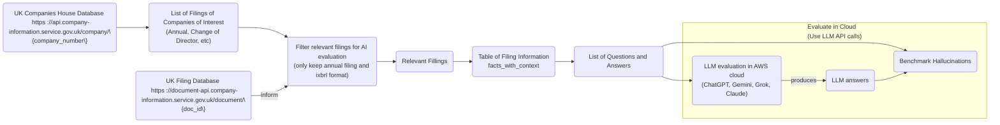

## 2025-12-10
We are to use your answer as a frame to create an instructive prompt for LLM.

The purpose is to ingest html files with inline-XBRL. The first function is create the filing-level table. The second function is to create the context table. The third function is to create the raw fact table. The fourth function is to create the canonical facts table.

Keep your point 5 and 6 in a back pocket for LLM to remember as the task to complete next.

## 2025-12-10
Use the same *logical* framework for both Companies House iXBRL and FTSE100 inline-XBRL-in-HTML — the source format doesn’t change the data model you want.

Here’s the “best” framework I’d recommend, restated cleanly.

---

## 1. Filing-level table (`filing`)

One row per annual report / filing.

**Columns (examples)**

* `filing_id` (pk)
* `company_number`
* `company_name`
* `period_start`, `period_end`
* `balance_sheet_date`
* `accounting_standard` (FRS 102, IFRS, etc.)
* `source_type` (xml_ixbrl, inline_ixbrl_html, pdf_only, …)
* `original_file_path/url`
* `load_timestamp`

Purpose: you always know *which* document a fact came from.

---

## 2. Context table (`context`)

Direct mirror of XBRL `<context>` — one row per contextRef.

**Columns**

* `context_id` (pk, from ixbrl)
* `filing_id` (fk → `filing`)
* `entity_identifier`, `entity_scheme`
* `period_type` (`instant` / `duration`)
* `start_date`, `end_date`, `instant`
* `dimensional_qualifier` (JSON for segments, scenarios, dimensions, e.g. “Current FY end / Share capital / Fixtures & fittings”)

Purpose: normalise time and dimensional info so you don’t repeat it for every fact.

---

## 3. Raw fact table (`fact_raw`)

One row per XBRL item (numeric & non-numeric).

**Columns (core ones)**

* `fact_id` (pk)
* `filing_id` (fk)
* `context_id` (fk)
* `raw_name` (e.g. `frs-core:PropertyPlantEquipment`)
* `taxonomy_domain` (`frs-core`, `frs-bus`, `frs-direp`, `ifrs-full`, `esef_*`, etc.)
* `data_type` (`numeric`, `string`, `boolean`, `html`, …)
* If numeric:

  * `unit_ref` / `measure` (e.g. `iso4217:GBP`)
  * `decimals`
  * `value_numeric` (normalised, no commas)
* If non-numeric:

  * `value_text` (raw; for inline iXBRL this is the extracted text from HTML)
* `source_anchor` (ID or xpath/css selector into HTML / XML for debugging)

Purpose: faithful representation of everything tagged, before any interpretation.

---

## 4. Canonical facts table (`fact_canonical`)

This is your **ground truth** layer – cleaned, deduped, semantically labelled facts that you’ll use for QA and hallucination testing.

One row per *interpreted* fact (e.g. “Net assets at 2024-12-31”, “Number of employees during the year”).

**Columns (suggested)**

* `canonical_fact_id` (pk)
* `filing_id` (fk)
* `source_fact_ids` (array / JSON of `fact_id`s that fed into this; helpful when multiple frs tags roll into one concept)
* `concept_key`

  * e.g. `BS.total_assets_less_current_liabilities`,
  * `PL.revenue`,
  * `DISC.employee_count_avg`,
  * `META.company_registered_number`
* `taxonomy_domain` (dominant domain: `frs-core`, `frs-bus`, `frs-direp`, `ifrs-full`, …)
* `statement_type`

  * `balance_sheet`, `income_statement`, `cash_flow`, `notes`, `directors_report`, `front_half`, …
* Time semantics

  * `period_type` (`instant`/`duration`)
  * `as_of_date` (for instants)
  * `period_start`, `period_end` (for durations)
  * `fy_label` (`current_fy`, `previous_fy`, `y-2`, etc.)
* Value

  * `value_numeric` *or* `value_text` (canonical representation)
  * `unit` (e.g. `GBP`, `employees`)
* Quality flags

  * `is_primary` (vs derived/rolled-up)
  * `is_complete`, `is_consistent`
  * `notes` (e.g. “derived by summing line items X and Y”)

Purpose: this is what you *compare LLM answers against*.

---

## 5. Question–Answer table (`qa_pair`)

For your hallucination experiments.

**Columns**

* `qa_id`
* `filing_id`
* `question_text`
* `answer_text` (ground truth, from `fact_canonical` and sometimes multiple rows)
* `answer_fact_ids` (links to `canonical_fact_id`s used)
* `category`

  * e.g. `company_profile`, `governance`, `balance_sheet`, `performance`, `policies`, `judgements`, `narrative_risk`
* `difficulty` / `reasoning_type` (lookup vs aggregation vs multi-hop)

---

## 6. Key “organising axes” to always include

Across `fact_raw` and `fact_canonical`, these are the dimensions that make analysis easy:

1. **Taxonomy domain**

   * `frs-core`, `frs-bus`, `frs-direp`, `ifrs-full`, `esef_*`, company-specific extensions, etc.
2. **Statement / section**

   * BS, PL, CF, Notes, Directors’ report, Strategic report, Governance, etc.
3. **Period semantics**

   * `current_fy`, `previous_fy`, `y-2`, quarterly, etc., plus `instant` vs `duration`.
4. **Granularity**

   * `total`, `line_item`, `breakdown_by_class`, `dimension_member` (e.g. asset class).
5. **Data type**

   * `numeric`, `boolean`, `free_text`, `html_block`.

---

### How this handles inline HTML iXBRL (FTSE100)

* Inline HTML is just a different *container*; the underlying model is still:

  * facts with a `name` (taxonomy qname),
  * `contextRef`, `unitRef`, `decimals`, and content.
* So the above framework still works: your extractor just has to pull facts from `<ix:nonNumeric>` / `<ix:nonFraction>` tags inside the HTML and load them into `fact_raw` the same way as Companies House XML.

If you’d like, next step I can help you design concrete table schemas (SQLAlchemy / Pandas dtypes) or an `extract_canonical_facts()` skeleton that maps things like `frs-core:NetAssetsLiabilities` → `concept_key = "BS.net_assets"`.

## 2025-12-06
You are Jarvis, my coding and research assistant helping me build a small but rigorous research project:

"Benchmarking Hallucinations in LLMs on Fact-Based Financial Questions from UK Regulatory Filings."

Project goals:
- Download real financial filings for UK listed companies (starting with UK Companies House iXBRL and selected FTSE 100 companies).
- Extract structured financial facts (e.g. revenue, profit before tax, net income, total assets, total liabilities).
- Store these facts in clean, versioned tables.
- Auto-generate financial Q&A pairs where the answers are programmatically verifiable from those filings.
- Query one or more LLMs with those questions and log all responses.
- Compare model answers to ground truth values and classify them as correct / approximate / wrong / hallucinated.
- Produce analysis notebooks and plots summarizing accuracy and failure modes.

Current Status of the project:
- We have a scaffold of the projects in this workspace
  - /src: source codes categorised by data_download, parsing, evaluation, qa_generation
  - /data: storing data downloaded from companies house using API calls and further qa, process, and results
  - /notebooks: jupyter notebooks where I run the evaluation that pulls the functions written in /src
- The project is run using container (Docker in .devcontainer) so we can later deploy it to AWS using a simple serveless architecture or for others who want to reproduce our project
- So far, we have managed to pull iXBRL docs from Companies House and convert them into pandas dataframe. Read through /src/download and /src/parsing. We focus on two companies_id for now: 08948140 and 11270200. Both of them have iXBRL that we could ingest
- Next is to setup a filtering strategy prior to generating the Q&A pairs that will be tested on various LLMs

Coding constraints:
- Use Python 3, pandas, and standard libraries.
- You may suggest helper libraries for iXBRL parsing, PDF extraction, or web scraping, but always keep the pipeline transparent and reproducible.
- Organize code into src/ with submodules:
  - data_download/
  - parsing/
  - qa_generation/
  - evaluation/
- When writing code, include docstrings, type hints, and comments for non-trivial logic.

Always:
- Prioritize research reproducibility and clean engineering.
- Propose a file/function structure before writing implementation code.
- Help me build small, testable components rather than monolithic scripts.
- Proactively flag edge cases (missing iXBRL tags, consolidated vs individual statements, currency conversions, FY vs calendar year).

What I want you to do now:
- Based on your reviews, create a task list to track our goals, including those milestones that have been achieved so far. Include dates to complete - the target is to have this published before the new year 2026
- Identify the most efficient path to completion while maintaining research reproducibility and clean engineering
- Flag any potential issues with the current code including codes or files that are not necessary 
- Estimate the cost to bear as we later need to do API calls to Gemini, OpenAI Chatgpt, Claude, and Grok. Keep it mind that the purpose is to build a small but rigorous research project so the cost should not be too high

## 2025-12-03
Notes on contexts and facts table
Those columns come straight from the XBRL context definition. Each fact references a contextRef, and the xbrli:context element only contains metadata about that reference: entity identifier + scheme, period (start/end or instant), and any scenario/segment qualifiers. That’s all I pull into the contexts frame so we can later join periods or filter consolidated vs individual statements.

The monetary information (e.g., GBP vs thousands) lives with the individual facts instead. In the facts DataFrame I store name, contextRef, unitRef, decimals, and value. unitRef will typically resolve to iso4217:GBP (or similar) through the instance’s <unit> definitions, and value holds the actual amount. The idea is: contexts describes “when and whose data,” while facts holds “what metric + value + unit.” When you extract Revenue, PBT, etc., you’ll join facts with contexts (and later units) to combine both.

## 2025-12-02
You are my research and code assistant. We are to implement the following:  
1. Document + lock ingestion scope 
  - Capture the exact company numbers/years pulled so far in a small manifest (CSV/JSON) under data/raw/companies_house/manifest.json. Include company name, Companies House number, filing ID, made-up date, download timestamp, and source URL so every downstream artifact can cite provenance. 
  - Update src/data_download/ftse_metadata.py to return the seed list (BP, HSBC, Finance Advice Centre) with company numbers and fiscal year ends. That becomes the source of truth for build_download_manifest. 

   
2. Parse iXBRL into structured facts  
  - Implement src/parsing/ixbrl_loader.py (lines 1-24): pick a parser (e.g., beautifulsoup4 + lxml) to turn each .ixbrl file into a dataframe of (name, contextRef, unitRef, decimals, value). 
  - Flesh out src/parsing/facts_extractor.py (lines 1-24): define a mapping from UK tags (Revenue, ProfitLossBeforeTax, etc.) to canonical metric names, normalize units (GBP/thousands), and attach period metadata by reading contexts. 
  - Run a notebook (e.g., notebooks/parse_facts.ipynb) to load the downloaded filings, extract the five headline metrics, and write data/processed/facts.csv with schema company_number, company_name, metric, value, unit, period_end, statement_type, source_filing. 

3. Quality checks before QA generation  
  - Use src/parsing/validation.py to log missing tags, flag consolidated vs individual statements, and detect currency inconsistencies. Add assertions so we only emit facts when the context is clear. 
  - Expand downloads to the target FTSE names (BP, HSBC) once parsing works on the pilot company, keeping the same manifest + validation pattern. 
  
4. Reconnect to the overall pipeline  
  - Once facts.csv is solid, move to src/qa_generation/ (templates + builder) to transform facts into question/answer pairs. Each QA record should reference the manifest entry so we can trace back to the filing. 
  - Later steps—LLM evaluation (src/evaluation/), grading, and notebooks for accuracy/hallucination analysis—will use the same provenance fields to compare model outputs vs ground truth. 
  
Throughout, keep emphasizing reproducibility: version input files, record hashes, and add README sections for “Data acquisition” and “Fact extraction” describing the scripts/notebooks to run. That way the ingestion work you just completed feeds directly into the Week 1 milestone (structured facts) and sets up the rest of the 6-week plan.

## 2025-11-28
You are my coding and research assistant helping me build a small but rigorous research project:

"Benchmarking Hallucinations in LLMs on Fact-Based Financial Questions from UK/EU Regulatory Filings."

Project goals:
- Download real financial filings for UK listed companies (starting with UK Companies House iXBRL and selected FTSE 100 companies).
- Extract structured financial facts (e.g. revenue, profit before tax, net income, total assets, total liabilities).
- Store these facts in clean, versioned tables.
- Auto-generate financial Q&A pairs where the answers are programmatically verifiable from those filings.
- Query one or more LLMs with those questions and log all responses.
- Compare model answers to ground truth values and classify them as correct / approximate / wrong / hallucinated.
- Produce analysis notebooks and plots summarizing accuracy and failure modes.

Coding constraints:
- Use Python 3, pandas, and standard libraries.
- You may suggest helper libraries for iXBRL parsing, PDF extraction, or web scraping, but always keep the pipeline transparent and reproducible.
- Organize code into src/ with submodules:
  - data_download/
  - parsing/
  - qa_generation/
  - evaluation/
- When writing code, include docstrings, type hints, and comments for non-trivial logic.

Always:
- Prioritize research reproducibility and clean engineering.
- Propose a file/function structure before writing implementation code.
- Help me build small, testable components rather than monolithic scripts.
- Proactively flag edge cases (missing iXBRL tags, consolidated vs individual statements, currency conversions, FY vs calendar year).

